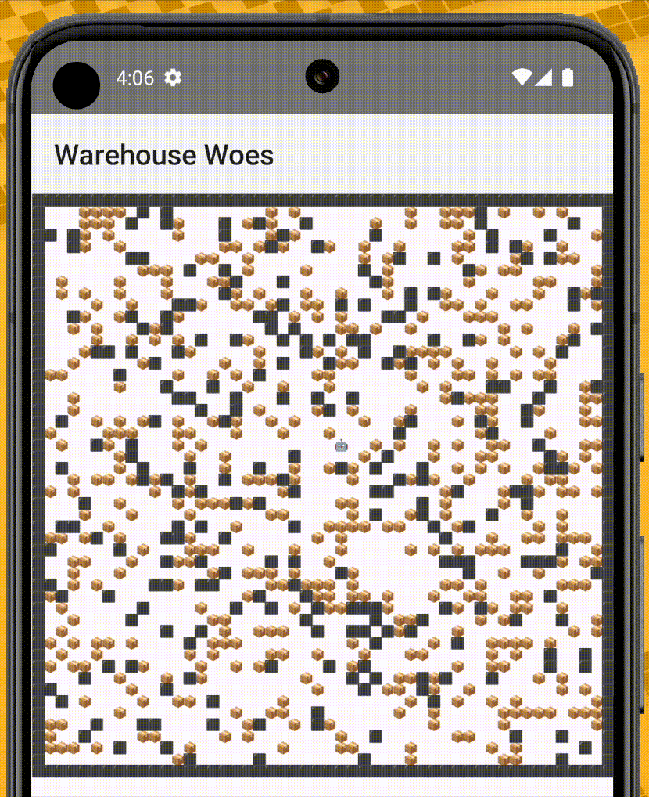

# Compose Multiplatform Advent of Code Visualiser

A Compose Multiplatform application designed to visualise solutions to the annual Advent of Code challenges.

## Examples

### Day 15: Warehouse Woes

The puzzle is randomly generated on each run to avoid publishing the puzzle input, [as per Eric Wastl's request][1]. The robot follows a random direction on each iteration.

> [!NOTE]
>
> Only part 1 is currently implemented.

| Android                                                          | iOS                                                      | Desktop                                                          |
|------------------------------------------------------------------|----------------------------------------------------------|------------------------------------------------------------------|
|  |  |  |

[1]: https://x.com/ericwastl/status/1465805354214830081
